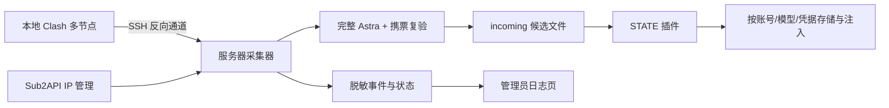

# Sub2API STATE Reuse

给支持插件 v2 的 Sub2API 号池增加 **STATE 292/332 票据复用、本地 Clash + IP 管理多出口采集、自动分组和管理员实时日志**。

这是独立插件与运维组件，不是整个 Sub2API 主站源码。公开版本 `1.0.13` 从已部署的 `1.0.11` 整理而来：移除生产固定地址，集中配置，并补齐测试和部署模板。安装本项目不会自动修改你的主站数据库结构。

> 292/332 是本项目采用的经验性票据形态，不是官方能力保证。采集器还要求实际响应模型为 `gpt-6-astra`、完整 `response.completed`，并携票再次验证；HTTP 200 或票据长度本身不能证明成功。本项目不提供账号、OAuth、代理订阅或现成票据。

## 能做什么

- 本地 Mihomo/Clash 独立监听多个节点，通过 SSH 反向通道供服务器采集。
- 同时读取号池「IP 管理」中启用、未过期的 HTTP / SOCKS5 代理；成功出口优先，其余轮换。
- 同一账号业务并发上限为 2，覆盖整个流式响应；排队服从请求取消和宿主超时。429 保留票据，业务至少退避 5 分钟（尊重更长 Retry-After）；401/403 仅撤销请求实际使用的当前票据，旧响应不能误删新票。退避目前保存在单个插件进程内，重启不持久化，宿主账号限流仍须保留。
- 默认每 20 秒检查；缺票/过期账号至少间隔 20 秒，每轮只试 1 个出口，失败后轮换；有效票临近到期时仍每 5 分钟续采，全局并发 3。
- 292/332 候选经完整 Astra 响应和携票复验后交给插件，按账号、模型、当前 OAuth 凭据隔离存储。
- 有有效 Astra 票据的账号进入“不降智分组”，没有则进入“降智分组”；保留其他分组。
- 请求有对应模型有效票据时注入，无票时普通转发。账号的业务代理仍由 Sub2API 控制。
- `/admin/state-harvest` 每 3 秒刷新账号状态和采集事件，支持筛选与暂停，仅管理员可读数据。



## 兼容性：先确认宿主

已知基础是 `rw0104/sub2api-cost-console` v0.3.0 / 内核 0.2.5 的插件环境，SDK 来自提交 `9b8ee29d0f2b1291be27449f84e14868b9d34c0c`。清单声明 `>=0.2.5 <0.3.0`，**不代表这个范围内任意分支都已验证**。

宿主必须具备：

1. 插件协议 v2，能力 `openai.oauth.protection_transport.v1`，可上传签名 `.s2plugin`。
2. ForwardRequestStart 的 `proxy_url` 透传、凭据转发及本地插件持久化目录。
3. 管理接口 `/api/v1/admin/plugins`、`/admin/accounts/:id/test` 和 `/auth/me`；管理员角色值为 `admin`。
4. PostgreSQL 中当前代码使用的 `accounts`、`groups`、`account_groups`、`proxies` 表及对应字段。
5. Linux amd64、Python 3.10+、curl、Docker CLI、systemd、nginx；编译需 Go 1.26+、GNU Make 和支持 race 测试的 C 工具链。

没有插件管理入口或相关能力时，先适配宿主，不能仅复制监控 HTML 就完成安装。宿主改造位置见 [适配与修改指南](docs/CUSTOMIZATION.md)。

## 目录

| 路径 | 用途 |
|---|---|
| `plugin/` | Go 插件、签名打包器、匹配的 Sub2API SDK 快照 |
| `collector/state-cron.py` | 账号范围、状态、冷却、任务调度、分组 |
| `collector/local_ip_harvest.py` | 多出口请求、完整流解析、复验和事件日志 |
| `collector/ticket_store.py` | 292/332 校验与候选原子交接 |
| `collector/settings.py` | 服务器配置入口 |
| `monitor/` | 只读管理员 API 和静态日志页面 |
| `deploy/` | 配置示例、systemd、nginx、日志轮转模板 |
| `tests/` | 不使用真实账号的 Python 测试 |

## 第一步：配置自己的服务器

服务器安装源码，约定路径 `/opt/sub2api-state-reuse`：

```bash
sudo git clone https://github.com/little-greenbean/sub2api-state-reuse.git /opt/sub2api-state-reuse
cd /opt/sub2api-state-reuse
sudo install -d -m 700 /etc/sub2api-state-reuse /var/lib/sub2api-state-reuse
sudo install -m 600 deploy/config.env.example /etc/sub2api-state-reuse/config.env
sudo install -m 600 deploy/admin.env.example /etc/sub2api-state-reuse/admin.env
sudo install -m 600 deploy/routes.example.json /etc/sub2api-state-reuse/routes.json
```

编辑以上三个文件。**示例值不是生产可直接使用的值**：

| 配置 | 必须核对什么 |
|---|---|
| `STATE_ROOT` | 采集状态、锁和脱敏日志目录；不放进 Git |
| `STATE_DYNAMIC_PROXY_GENERATORS_FILE` | 动态 HTTP 代理生成器的私有 JSON 配置文件 |
| `STATE_TICKET_STORE` | 宿主机上的 `tickets.json` 路径，与容器 `/app/data/fn-state-reuse/tickets.json` 指向同一份 bind mount |
| `SUB2API_BASE_URL` | 号池管理 API，不要误填中转主站；包含 `/api/v1` |
| `SUB2API_ENV_FILE` | 独立管理员凭据文件，内容为 `ADMIN_EMAIL` / `ADMIN_PASSWORD`，0600 |
| `SUB2API_PG_CONTAINER` | **号池** PostgreSQL 容器名；容器内应提供 `POSTGRES_USER` / `POSTGRES_DB` 和 psql |
| `STATE_PLUGIN_ID` | 上传插件后后台分配的数字 ID，不保证是 2 |
| `STATE_READY_GROUP` / `STATE_FALLBACK_GROUP` | 两个已存在且名称唯一、不同的分组 |
| `STATE_ROUTES_FILE` | Clash 路由名与服务器 loopback 端口列表；不放代理密码 |
| `STATE_PLUGIN_UID` / `STATE_PLUGIN_GID` | 容器内运行插件的 UID/GID，用于写入候选文件；不要盲用 1000 |
| `STATE_MONITOR_PORT` | 默认仅监听 `127.0.0.1:17843`；改端口时同步 nginx |

可选的动态 HTTP 代理生成器文件使用以下格式，并应设为 `0600`。`url` 必须返回一行 `IP:PORT`；采集器每次最多读取 4 KiB，只接受合法 IP 和端口。接口失败时会跳过并继续使用 Clash/IP 管理出口。真实生成器 URL 通常包含鉴权信息，不要提交到 Git：

```json
[
  {"name": "rotating-provider", "url": "https://provider.example/generate"}
]
```

缺票时动态出口与静态出口交替尝试；每次选中动态出口都会重新调用生成器，因此连续两次动态尝试可能得到不同 IP。

确认 Docker 挂载和 UID/GID，例如：

```bash
# 替换为你的号池应用容器
sudo docker inspect YOUR_SUB2API_CONTAINER --format '{{json .Mounts}}'
sudo docker exec YOUR_SUB2API_CONTAINER id
```

如果 `/srv/sub2api/data` 挂载为 `/app/data`，默认票据路径就是正确的。先用实际 UID/GID 创建该宿主目录并授予插件写权限。不要覆盖已有 `tickets.json`。

管理员账号要求可用的邮箱/密码登录；开启必须交互的 MFA、SSO 等场景，需要自行适配 `collector/state-cron.py::login()`。工具不会替你绕过 MFA。

## 第二步：配置 Clash 和 SSH 通道

本机准备独立 Mihomo 配置，参考 [mihomo.example.yaml](deploy/mihomo.example.yaml)：

1. `proxies` 填入你自己的节点定义。
2. 每个 `listeners[].proxy` 填真实节点名；端口使用 `18300`、`18301` 等。
3. 启动独立核心：`mihomo -d ./state-core -f ./mihomo.yaml`。不用切换日常 Clash 的选择器。
4. 在本机建立反向通道；`YOUR_SSH_ALIAS` 是你已配置公钥登录的服务器别名：

```bash
ssh -NT -o BatchMode=yes -o ExitOnForwardFailure=yes \
  -o ServerAliveInterval=30 -o ServerAliveCountMax=3 \
  -R 127.0.0.1:18300:127.0.0.1:18300 \
  -R 127.0.0.1:18301:127.0.0.1:18301 \
  YOUR_SSH_ALIAS
```

服务器的 `routes.json` 对应这些端口。名称用于展示；实际出口由本地监听器决定。只使用 IP 管理时，可将 routes 文件设为 `[]`。

独立 Clash 核心与 SSH 要长期运行，可使用你现有的 launchd/systemd 进程管理。电脑睡眠或离线会导致 Clash 出口不可用；IP 管理代理仍能独立工作。不要把代理账号密码提交到仓库。

**注意两种访问视角**：采集器在宿主机访问 `127.0.0.1:18300`；插件在应用容器内，它的 `127.0.0.1` 不等于宿主机。给插件准备一个容器可达的代理端点，再配置 `proxy_url`。例如用 `systemd-socket-proxyd` 从 Docker 网关地址 `:17892` 转到宿主 `127.0.0.1:18300`，并只允许目标容器网络访问。具体模板见 [网络适配](docs/CUSTOMIZATION.md#代理与容器网络)。

## 第三步：构建、安装插件

开发机或构建机安装 Go 1.26+；Node.js 只用于 JS 语法检查。

```bash
make check test
make build
```

产物：`plugin/state-reuse-1.0.13.s2plugin`。第一次打包会生成你自己的 `plugin/publisher.key`，后续升级必须保存并复用它。私钥已被 `.gitignore` 排除；CI 每次生成的临时密钥不应当作正式发布身份。

在号池管理员后台：

1. 上传 `.s2plugin`，确认自有发布者指纹。
2. 查看插件 ID，并更新 `STATE_PLUGIN_ID`。
3. 参考 [plugin-config.example.json](deploy/plugin-config.example.json) 填插件配置：`proxy_url` 为**容器可达**的采集代理；`accounts` 填自己要保护的账号 ID，不能直接照抄示例；`harvest_proxy_api` 留空即可。
4. 为 `openai.oauth.protection_transport.v1` 设置**明确且非空的账号范围**。该宿主的空路由账号范围可能代表全部账号。
5. 启用插件并确认 runtime healthy、版本为 `1.0.13`。没有经过宿主认证的版本可能需要后台确认“接受未测试版本”。

在两个目标分组中加入你要自动维护的 OAuth 账号。采集器会同步两个分组成员的插件保护范围并保留以前已保护的账号；停用整个采集器不会清除原路由范围。需要移除账号时，应同时检查分组、插件配置及路由绑定。

插件自身仍有请求时续采路径，它只做自身模型/完整流校验，不共享 Python 采集器冷却，也不执行 Python 的第二次携票复验。多出口轮换与二次复验由外部采集器负责；不要把两条路径混为一谈。

## 第四步：先跑一轮，再启用定时器

手动执行前，配置文件已经由你检查过；以下只加载本项目的独立配置，不加载主站 `.env`：

```bash
sudo bash -c 'set -a; . /etc/sub2api-state-reuse/config.env; set +a; exec python3 /opt/sub2api-state-reuse/collector/state-cron.py'
```

这一步会发起真实采集/复验请求、消费账号额度，并按票据状态更新两个分组。观察输出后再启用：

```bash
sudo install -m 644 deploy/state-collector.service deploy/state-collector.timer deploy/state-monitor.service /etc/systemd/system/
sudo systemctl daemon-reload
sudo systemctl enable --now state-collector.timer state-monitor.service
sudo systemctl list-timers state-collector.timer
```

20 秒是检查周期：如果上一轮仍在运行，systemd 和文件锁会阻止重叠，不保证长请求时仍每20秒发起请求。配置路由不同不保证上游看到的真实出口IP不同。已有429冷却与401/403暂停不会因提频而清除。

采集器默认 root 运行，因为需要 Docker CLI、私有配置及设置候选文件所有者。可按自己的权限模型调整，但这些权限必须等价提供。不要同时保留另一个旧 cron 采集任务。

## 第五步：将日志页面挂到 sub 后台

将 [nginx-locations.conf](deploy/nginx-locations.conf) 中两个 `location` 加到**号池管理员页面同一个 `server {}`**，保留原应用/API转发。可选：将 [nginx-entry.conf](deploy/nginx-entry.conf) 内容加到现有 `location / {}`，给管理员后台增加右下角入口。

```bash
sudo nginx -t
sudo systemctl reload nginx
```

登录号池管理员后访问：

```text
https://YOUR_SUB_DOMAIN/admin/state-harvest
```

页面沿用同源 `localStorage.auth_token`；API 每次调用宿主 `/auth/me` 校验 `role=admin`。HTML 壳可公开访问，采集数据未登录 401、普通用户 403。不需要把管理员密码写进前端。会话过期时重新登录主后台。

此 nginx 接入方式无需重建 Sub2API 镜像。若你要原生侧栏入口，见 [前端修改](docs/CUSTOMIZATION.md#前端展示)。

## 实时日志与排障

```bash
# systemd 运行/异常日志（包含每次请求进度）
sudo journalctl -u state-collector.service -f

# 只看脱敏采集事件
sudo tail -n 50 -F /var/lib/sub2api-state-reuse/harvest-events.jsonl

# 最近一次完整检查、实际入库票据长度与到期时间
sudo python3 -m json.tool /var/lib/sub2api-state-reuse/cron-status.json
```

| 现象 | 检查位置 |
|---|---|
| `312/356` 或实际模型不是 Astra | 正常拒收，不通过换长度规则伪装成功 |
| `292/332`，但没有 `response.completed` | 完整流失败，不入库 |
| 有 `candidate_queued`，没有 `renewed=true` | 确认 incoming/tickets 挂载、UID/GID、插件启用和账号路由 |
| `401/403` | 采集器按当前凭据暂停；修复账号认证后再采，不删状态强行撞 |
| `429`/额度错误 | 尊重恢复时间；不换出口继续同一轮 |
| curl 7 / 28 | 反向通道、Clash 监听、本地休眠、代理可达性或超时 |
| 页面 401/403 | 同域管理员登录、token是否过期、宿主角色字段 |
| 页面提示状态过期 | timer、上次 service 日志、plugin ID和分组是否正确 |
| “运行时信息与清单不一致” | `plugin/main.go` 与 `cmd/pack/main.go` 的版本/能力必须一致，重新构建打包 |

安装 `deploy/logrotate.conf` 前先把两条日志路径改成你的值，再复制到 `/etc/logrotate.d/sub2api-state-reuse`。默认保留7份；页面显示最近500条事件。

## 想改规则/界面？

直接看 [docs/CUSTOMIZATION.md](docs/CUSTOMIZATION.md)：包括改端口/路径、宿主 API/数据库、接受模型/长度、轮换策略、UI 入口，以及修改后需要跑哪些测试。

升级、回退和凭据保护见 [docs/OPERATIONS.md](docs/OPERATIONS.md)。本仓库不包含生产配置、票据、账号凭据、代理订阅或签名私钥。

## 许可证与来源

按 LGPL-3.0 分发，见 [LICENSE](LICENSE)、[COPYING](COPYING)、[NOTICE](NOTICE)。`plugin/pkg/pluginapi` 保留上游 SDK；不是 OpenAI 或 Sub2API 官方插件。
