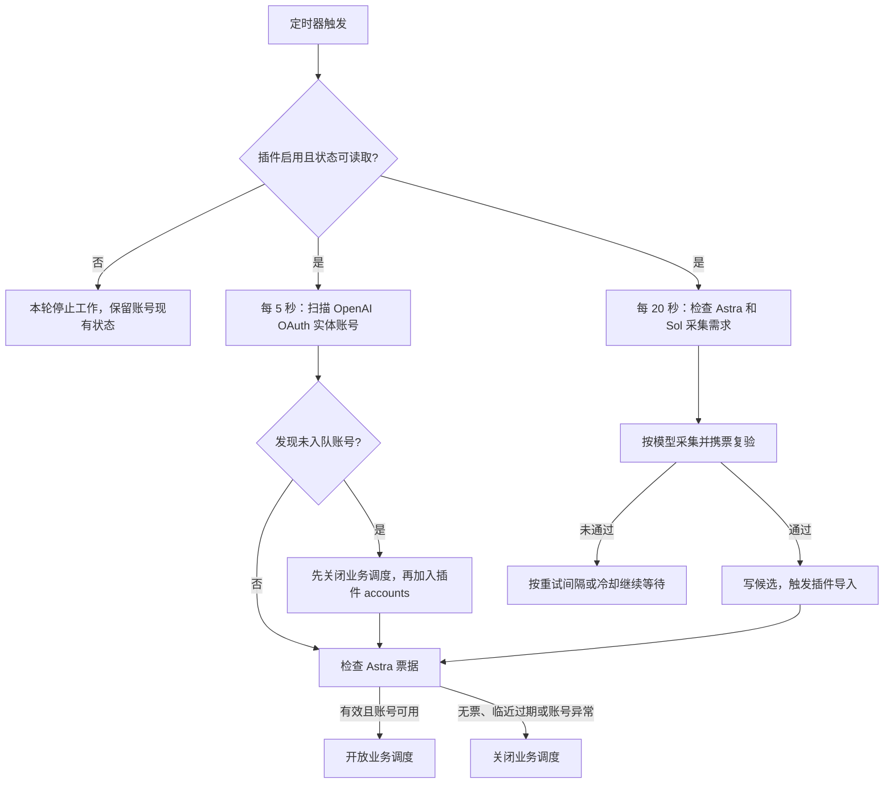

# 自动化脚本与任务关系

本说明对应 `local/sub2api-v1` 分支。这里列出的脚本、服务模板和测试均包含在仓库中；服务器实际填写的环境配置、密码、票据与日志不在仓库中。首次安装见 [README.md](../README.md)。

## 已提交的脚本

| 文件 | 职责 | 启动方式 |
| --- | --- | --- |
| [scheduling.py](../collector/scheduling.py) | 发现新账号、先停调再入队、同步账号业务调度资格 | `state-scheduling.service`，每 5 秒触发 |
| [state-cron.py](../collector/state-cron.py) | 读取队列、生成 Astra / Sol 探测任务、触发候选导入、保存结果 | `state-collector.service`，每 20 秒触发 |
| [automation.py](../collector/automation.py) | 复查插件启停状态，停用或读取失败时停止当前自动化轮次 | 共享模块，无独立服务 |
| [local_ip_harvest.py](../collector/local_ip_harvest.py) | 使用采集代理发出请求、检查真实模型、携票复验、管理重试和冷却 | 由采集器调用 |
| [ticket_store.py](../collector/ticket_store.py) | 校验票据并原子写入 `incoming/`，为插件提供候选 | 由采集器调用 |
| [settings.py](../collector/settings.py) | 读取路径、插件 ID、代理来源和自动化开关 | 共享配置模块 |
| [server.py](../monitor/server.py) | 只读监控 API，每次向主站验证访问者管理员身份 | `state-monitor.service` 常驻 |
| [app.js](../monitor/app.js) / [index.html](../monitor/index.html) | Astra / Sol 双列状态、账号搜索、事件筛选，每 3 秒刷新 | 同源 `/admin/state-harvest` 页面 |
| [entry.js](../monitor/entry.js) | 在管理员页面显示日志入口 | Nginx 可选脚本注入 |

配套的 `state-scheduling.service/.timer`、`state-collector.service/.timer`、`state-monitor.service`、Nginx 路由和日志轮转模板都位于 [deploy/](../deploy/)。

## 执行流程

### 新账号自动入队

`STATE_AUTO_ENROLL=true` 时，扫描未删除的 OpenAI OAuth 实体账号，排除影子账号及 synthetic UI 测试账号。新账号先通过主站 `POST /admin/accounts/:id/schedulable` 设为不可调度，成功后才加入插件配置中的 `accounts`。

它不是导入接口内的事务钩子：通常要等待下一个 5 秒检查周期，服务繁忙时可能更久。导入后、首次扫描前的调度状态仍由主站决定；需要从导入瞬间停调时，应在导入端设置。停用或错误账号可以被纳入管理，但不会绕过自身状态去采集。

### 业务调度与刷票分别控制

推荐配置 `STATE_TICKET_SCHEDULING=true`、`STATE_REQUIRED_MODELS=gpt-6-astra`：

| 状态 | 业务调度 | 后台采集 |
| --- | --- | --- |
| Astra 有有效票据，账号正常 | 可调度 | 独立检查 Astra 续票和 Sol 缺票 |
| Astra 无票或距过期不足 30 秒 | 不可调度 | 继续采集，合格票据入库后恢复 |
| 只有 Sol 有票 | 不可调度 | 继续采集 Astra |
| Astra 有票、Sol 无票 | 可调度 | 继续采集 Sol |
| 账号停用、认证暂停或额度冷却 | 保持主站和采集器的暂停/冷却约束 | 不强行刷票 |
| 插件停用或状态不可读取 | 自动化不再修改调度开关 | 不再采集 |

本规则通过账号的调度开关排除无票账号，没有新增业务请求拦截。`STATE_AUTO_GROUP=false` 时不移动账号分组。已经发出的请求不会因账号随后停调而被撤回。

自动化管理着队列账号的 `schedulable` 开关；人工长期暂停应停用账号或加入插件 `suspended`。仅移出 `accounts` 会被自动入队再次纳入。

### 插件开关联动

插件处于 `enabled` 状态才执行入队、采集和调度同步；停用、启动中、错误状态或读取失败会暂停当前轮次。运行中的采集 curl 会复查开关并尝试取消；已经到达上游的请求无法撤销。

插件停用时定时器保持开启，但只进行必要的开关检查，不扫描账号、不改配置、不改调度。监控服务仍运行并显示暂停原因。插件重新启用后，下轮检查恢复工作，补录停用期间新增的账号。

### Astra / Sol 票据隔离

两种模型分别采集、校验和携票复验；必须实际返回目标模型，并完整结束响应，才能接受 292 / 332 候选。入库键包含账号 ID、模型和当前凭据哈希，Sol 不使用 Astra 的票据。

### 240 秒捆绑与 Cookie 回放

上游把每个签发的 STATE 与会话 Cookie 配对：采集响应中的 `Set-Cookie` 会与票据捆绑存储（只保留 `name=value`，属性不落盘、不进日志），携票复验和插件业务注入都回放这条 Cookie；没有配对 Cookie 的票据会被上游忽略。捆绑约 240 秒后整体失效，因此有效票超过 150 秒就按 30 秒节奏重新采集，续采失败不影响仍在窗口内的旧票；账号调度按 `SCHEDULING_MARGIN`（30 秒）提前停调。

同一账号的两个模型依次执行，全局最多 3 个账号同时采集。模型普通重试时间各自维护，认证与配额冷却跨模型共享。旧 Astra 冷却不会因引入 Sol 被清除。代理每分钟轮换时，20 秒检查可能仍多次遇到同一出口，脚本不保证每轮都换到新 IP。

配置了 `STATE_DYNAMIC_PROXY_GENERATORS_FILE` 时，采集出口在 Clash、IP 管理之外增加动态 HTTP 生成器（`动态IP/<名称>`），缺票时动态出口与静态出口交替尝试；每次选中动态出口都重新调用生成器，连续两次动态尝试可能得到不同 IP。生成器接口失败会被跳过，不影响静态出口。

插件还保留原有业务请求内采集路径，与外部采集器的持久冷却状态独立。插件启用、Sol 缺票时，Sol 请求可能触发内采；仍没有合格票据时按原行为无票转发。账号“可调度”仅表示符合 Astra 调度条件，不代表 Sol 已有票。

## 状态文件

以下都是运行产物，保存在私有目录，已加入 Git 忽略规则：

| 文件 | 用途 |
| --- | --- |
| `STATE_ROOT/automation-status.json` | 自动化总状态、插件状态、当前账号范围 |
| `STATE_ROOT/scheduling-status.json` | 账号调度资格及分模型票据摘要 |
| `STATE_ROOT/cron-state.json` | 最近尝试时间、凭据隔离的暂停/冷却游标和最近结果 |
| `STATE_ROOT/cron-status.json` | 最近完整采集轮次与分模型状态 |
| `STATE_ROOT/harvest-events.jsonl` | 最近采集、复验、入队和调度变更事件 |
| `STATE_TICKET_STORE` / 同目录 `incoming/` | 原始票据及等待导入的候选，不能公开 |

模型状态与业务调度在页面上分别展示。`candidate_queued` 表示通过复验、交给插件待导入；`account_finished` 的 `renewed=true` 才表示已从持久化存储确认入库。“暂停刷新”只影响浏览器，不会停止采集。

## 必要配置

复制 [config.env.example](../deploy/config.env.example) 和 [admin.env.example](../deploy/admin.env.example)，在服务器私有目录填写，保持权限 `0600`。需要匹配自己的主站管理 API、插件 ID、PostgreSQL 容器、数据挂载路径与插件 UID/GID。

默认 `STATE_PROXY_SOURCE=plugin` 从主站加密插件配置读取采集代理；业务代理仍使用账号本身的配置。服务器与插件容器都应能访问采集代理。

上传 `.s2plugin` 只安装插件进程，不会安装宿主机 Python 脚本或 systemd 服务。必须按 [README.md](../README.md#部署自动化) 部署配套服务，启动与升级命令见 [OPERATIONS.md](OPERATIONS.md)。
